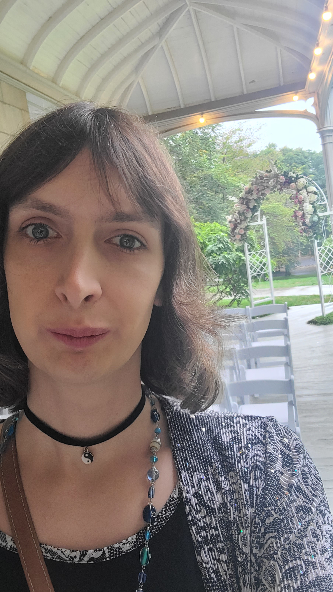

# About

5th year CS PhD candidate working with the [Computational Logic Center](http://clc.cs.uiowa.edu/) at the
University of Iowa, advised by [Dr. Aaron Stump](http://homepage.divms.uiowa.edu/~astump/). Research assistantship working
on [Cedille](https://cedille.github.io/), an experimental dependent type theory.

Research interest is programming language theory, specifically (dependent)
type theory, inductive definitions, recursion schemes, elaboration, and
bidirectional type inference. Also interested in programming language
semantics, including categorical and realizability.
[CV](assets/cv.pdf).

## Locations

[Mathematical Sciences](http://www.divms.uiowa.edu/) University of Iowa, Iowa City, IA 52236.

-   Campus mailing address: 14 MacLean Hall
-   Office: Seamans Center for the Engineering Arts and Sciences, #1422
-   Email: [christopher-jenkins@uiowa.edu](mailto:christopher-jenkins@uiowa.edu)
-   Website: <https://cwjnkins.github.io/>
-   Social Media: [Github](https://github.com/cwjnkins), [Cedille Programming Language (YouTube)](https://www.youtube.com/channel/UCfV0BJz4nltlj-4yWNZ34lw), [ResearchGate](https://www.researchgate.net/profile/Christopher_Jenkins12)

# Papers

-   **Monotone Recursive Types and Recursive Data Representations in Cedille**
    
    Jenkins, Christopher and Stump, Aaron. *[J. MSCS](https://www.cambridge.org/core/journals/mathematical-structures-in-computer-science/article/monotone-recursive-types-and-recursive-data-representations-in-cedille/49B54AE2D6EAEC542726B65DA7CFC140)* (2021)
    
    [paper](assets/JS21_Recursive-Types-and-Data-Representations-in-Cedille.pdf) [bib](assets/JS19_Recursive-Types-and-Data-Representations-in-Cedille.bib) [code](https://github.com/cedille/cedille-developments/tree/master/recursive-representation-of-data)

-   **Simulating large eliminations in Cedille** (extended abstract)
    
    Jenkins, Christopher and Marmaduke, Andrew and Stump, Aaron. *[TYPES 2021](https://types21.liacs.nl/)*
    
    [paper](assets/JMS21_Simulating-Large-Elim-Cedille.pdf)

-   **Zero-cost Constructor Subtyping**
    
    Marmaduke, Andrew and Jenkins, Christopher and Stump, Aaron. *[IFL 2020](https://www.cs.kent.ac.uk/events/2020/ifl20/)*
    
    [paper](assets/MJS20_Zero-Cost-Constructor-Subtyping.bib) [bib](./assets/MJS20_Zero-Cost-Constructor-Subtyping.bib)

-   **Strong Functional Pearl: Harper's Regular-Expression Matcher in Cedille**
    
    Stump, Aaron and Jenkins, Christopher and Spahn, Stephan and McDonald,
    Colin. *[ICFP 2020](https://icfp20.sigplan.org/)*
    
    [paper](assets/SJSM20_Strong-Functional-Pearl-Harpers-Regular-Expression-Matcher.pdf) [bib](assets/SJSM20_Strong-Functional-Pearl-Harpers-Regular-Expression-Matcher.bib) [talk](https://www.youtube.com/watch?v=fakSKvP9yaM&t=2580s)

-   **Efficient lambda encodings for Mendler-style coinductive types in Cedille**
    
    Jenkins, Christopher and Stump, Aaron and Diehl, Larry. *[MSFP 2020](https://msfp-workshop.github.io/msfp2020/)*
    
    [paper](assets/JSD20_Efficient-Mendler-Style-Coinductive-Types.pdf) [bib](assets/JSD20_Efficient-Mendler-Style-Coinductive-Types.bib) [slides](assets/JSD20_Efficient-Mendler-Style-Coinductive-Types_Talk.pdf) [talk](https://youtu.be/mrgS7dcA6z4?t=1860) [code](https://github.com/cedille/cedille-developments/tree/master/efficient-mendler-codata)

-   **Quotients by Idempotent Functions in Cedille**
    
    Marmaduke, Andrew and Jenkins, Christopher and Stump, Aaron. *[TFP 2019](https://www.tfp2019.org/)*
    
    [paper](assets/MJS19_Quotients-Idempotent-Functions-Cedille.pdf) [bib](assets/MJS19_Quotients-Idempotent-Functions-Cedille.bib) [code](https://github.com/cedille/cedille-developments/tree/master/idem-quotients)

-   **Spine-local Type Inference**
    
    Jenkins, Christopher and Stump, Aaron. *[IFL 2018](http://2018.iflconference.org/)*
    
    [paper](assets/JS18_Spine-local.pdf) [bib](assets/JS18_Spine-local.bib) [slides](assets/JS18_Spine-local-Slides.pdf) [appendix](assets/JS18_Spine-local-Appendix.pdf)

## Unpublished

-   **Elaborating course-of-values induction in Cedille**
    
    Jenkins, Christopher and Firsov, Denis and Diehl, Larry and McDonald, Colin
    and Stump, Aaron. (2020)
    
    [paper](assets/JFDMS20_Elaborating-CV-Induction.pdf) [appendix](assets/JFDMS20_Elaborating-CV-Induction-Appendix.pdf) [code](assets/JFDMS20_Elaborating-CV-Induction-Code.tar.gz)

## Reports

-   **Elaborating inductive definitions in Curry-style polymorphic type theory**
    
    Comprehensive exam report (2020)
    
    [paper](assets/Je20-Comp.pdf)
-   **Bidirectional type inference in programming languages**
    
    Qualifying exam report (2018)
    
    [paper](assets/Jen18_Qualifying-Exam.pdf)

